<h1 align="center">AuditVault</h1>

<p align="center">
  <b>The smart contract security knowledge base.</b><br/>
  <em>Every HIGH/CRITICAL finding. Every major hack. All linked, classified, and queryable.</em>
</p>

<p align="center">
  
</p>


<p align="center">
  
  
  
  
</p>

<p align="center">
  <b>Structured</b> · Obsidian wikilinks &nbsp;·&nbsp; <b>Deep taxonomy</b> · 10+ tag axes &nbsp;·&nbsp; <b>100% Node.js</b> · one npm install
</p>


<br/>

<h2 align="center">What's inside</h2>

<p align="center">
AuditVault is an <a href="https://obsidian.md/">Obsidian</a> knowledge base for smart contract security research.<br/>
It aggregates audit findings and DeFi hack post-mortems, enriches them with a deep classification<br/>
taxonomy, and links everything together - protocols to auditors, findings to bug patterns, hacks to attack vectors.<br/><br/>
Think of it as <em>searchable institutional memory</em> for security researchers.
</p>

| Directory          | Source                                                                                                                                                                   | Content                         |
| ------------------ | ------------------------------------------------------------------------------------------------------------------------------------------------------------------------ | ------------------------------- |
| `findings/`        | [Solodit/Cyfrin](https://solodit.cyfrin.io), [Frankcastleauditor](https://github.com/Frankcastleauditor/public-audits), [Auditware](https://github.com/Auditware/audits) | HIGH/CRITICAL findings          |
| `hacks/`           | [rekt.news](https://rekt.news/leaderboard)                                                                                                                               | Hacks with confirmed loss       |
| `auditors/`        | Generated                                                                                                                                                                | Per-auditor profiles with stats |
| `protocols/`       | Generated                                                                                                                                                                | Per-protocol pages with tags    |
| `classifications/` | Hand-curated                                                                                                                                                             | Full vulnerability taxonomy     |
| `checklists/`      | Generated                                                                                                                                                                | Per-sector audit checklists     |

<br/>

<h2 align="center">Deep taxonomy</h2>

<p align="center">Every finding is tagged across 10+ axes - queryable in Obsidian via tags, graph view, or Dataview.</p>

```yaml
tags:
  - severity/high
  - lang/solidity
  - blockchain/evm
  - sector/lending
  - platform/code4rena
  - has/poc
  - vuln/reentrancy/read-only
  - impact/loss-of-funds/direct-drain
  - trigger/flash-loan
  - precondition/flash-loan-available
  - fix/use-reentrancy-guard
  - novelty/known-pattern
  - blast-radius/protocol-wide
protocol: "[[Aave]]"
auditors:
  - "[[trust]]"
report: "https://github.com/..."
```

<br/>

<h2 align="center">Setup</h2>

<p align="center">Requires <a href="https://obsidian.md/">Obsidian</a> (free). Clone and open as vault.</p>

```bash
git clone https://github.com/forefy/AuditVault
```

<br/>

<h2 align="center">Crawler</h2>

<p align="center">
The <code>vault-admin/crawler/</code> directory is a pure Node.js pipeline that keeps the vault fresh.<br/>
All scripts are <b>re-run safe</b> - they skip files that already exist or are already tagged.
</p>

```bash
cd vault-admin/crawler && npm install
```

```bash
# Scrape
node scrape_all.js              # Solodit/Cyfrin findings
node scrape_rekt.js             # rekt.news hacks
GITHUB_TOKEN=... node scrape_github_audits.js

# Tag
node tag_new.js                 # frontmatter for new findings
node tag_vault.js               # protocol/ sector tags
node tag_report_lang.js         # lang/ tags from GitHub report sources
node tag_report_sector.js       # sector/ tags (content + report fallback)
node tag_bugs.js                # vuln/ impact/ trigger/ full taxonomy

# Enrich
node normalize_protocols.js     # protocol: raw strings → [[WikiLink]]
node tag_protocols.js           # tag protocol pages from proto_data.json
node gen_auditor_profiles.js    # rebuild auditors/ profiles
node gen_sector_checklists.js   # build checklists/ from tagged findings
```

<br/>

<h2 align="center">Contributions</h2>

<table align="center">
<tr>
    <td align="center">
        <a href="https://github.com/forefy">
            
            <br/><sub><b>forefy</b></sub>
        </a>
    </td>
</tr>
</table>

<p align="center">PRs welcome - new classification rules, manual overrides, scraper improvements, or additional sources.</p>
